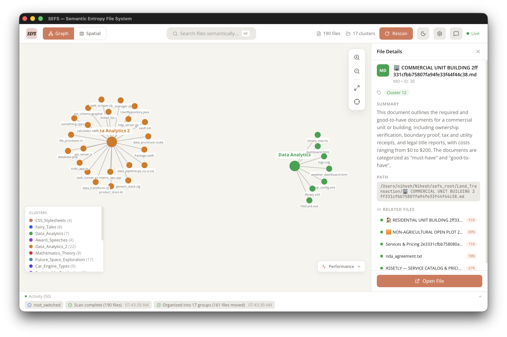
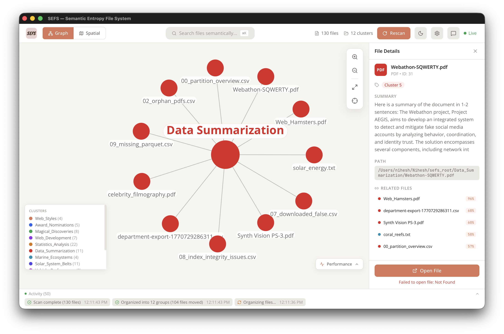
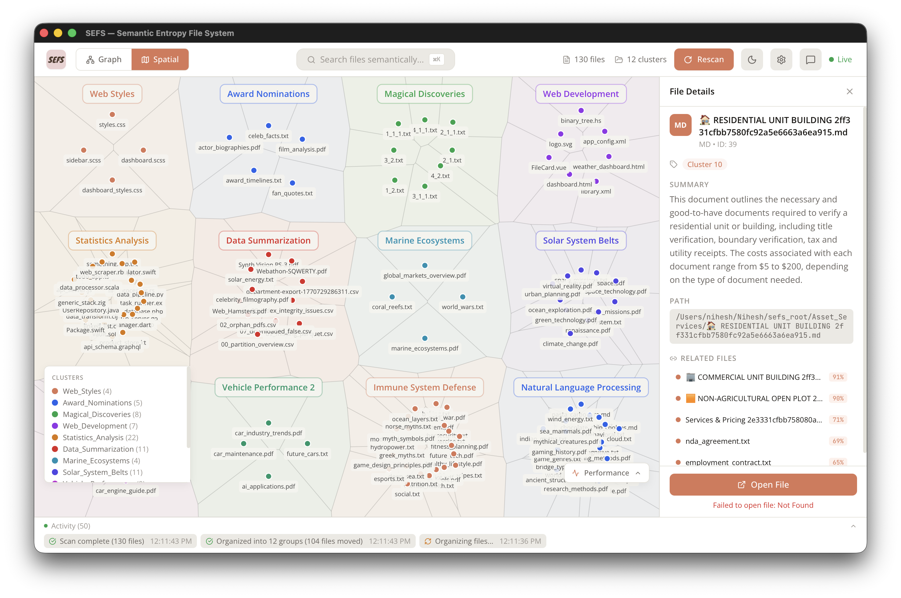
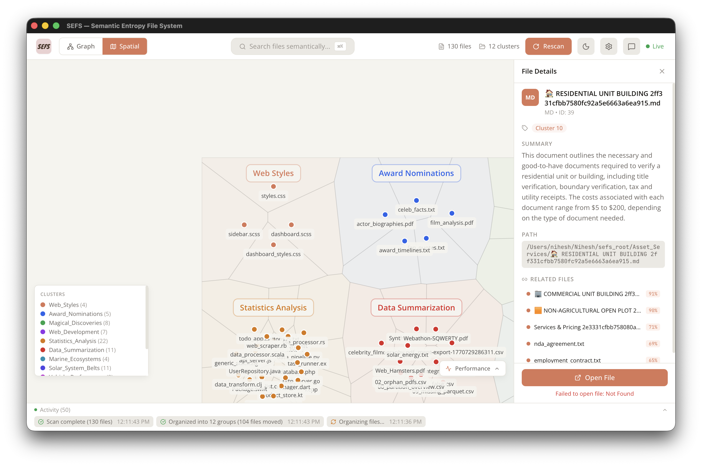
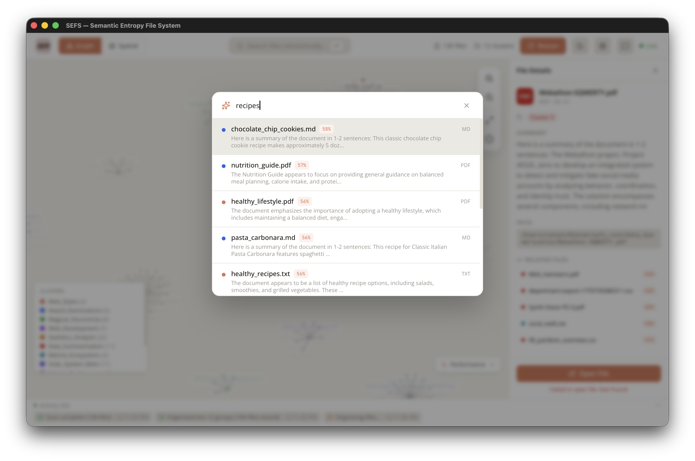
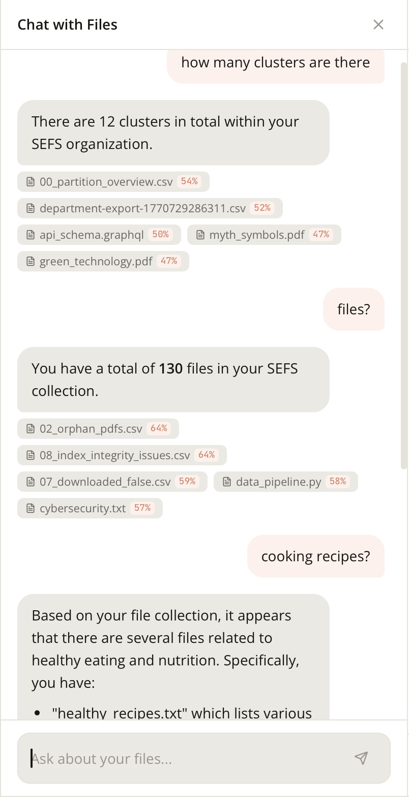
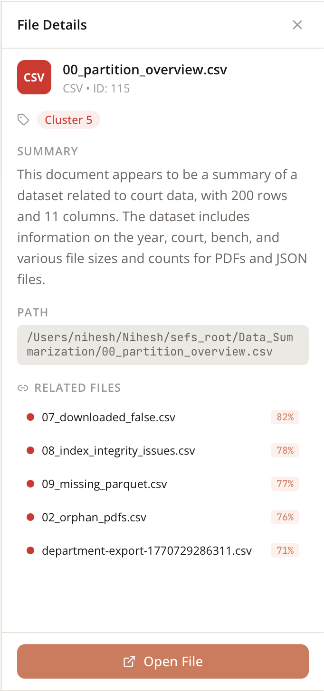
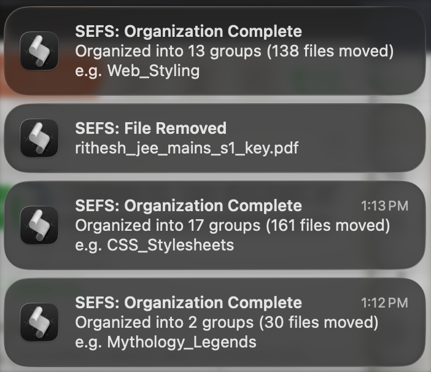
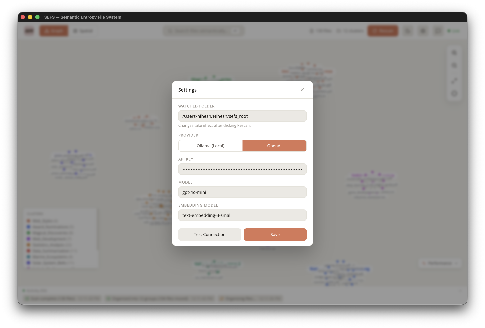

<p align="center">
  
</p>

# SEFS - Semantic Entropy File System

SEFS is a self-organising file manager that replaces static, manually created folder hierarchies with a dynamic semantic layer. Drop files into a single root folder, and SEFS will automatically read their content, group related files into meaningful folders, and keep the OS-level file structure in sync  all in real time.

---

## Problem

Traditional file management forces users to manually create and maintain folder trees. Over time these become disorganised, inconsistent, and hard to navigate. Files that are conceptually related end up scattered across unrelated directories.

## Solution

SEFS monitors a single root folder. Every file that appears is:

1. **Extracted** - content is read from 140+ file types (PDFs, DOCX, source code, markdown, CSV, images via OCR, and more).
2. **Embedded** - text is converted into a vector embedding using Ollama (local) or OpenAI.
3. **Clustered** - HDBSCAN groups files by semantic similarity. UMAP projects them into 2D for visualisation.
4. **Named** - each cluster folder gets a descriptive name generated by an LLM.
5. **Synced** - files are physically moved into their semantic folders on disk. Finder/Explorer reflects the changes immediately.
6. **Watched** - any new file, edit, rename, or deletion is detected and the pipeline runs again.

The result: your filesystem organises itself by meaning, not by arbitrary folder names you chose months ago.

---

## Screenshots

### Graph View - Files as nodes, clusters as groups, links by similarity



### Graph View - Expanded cluster detail with file metadata on hover



### Spatial View - UMAP 2D projection of file embeddings



### Spatial View - Zoomed in on a cluster region



### Semantic Search - Find files by meaning, not keywords



### RAG Chatbot and File Details

<p>


</p>

### Desktop Notifications - Real-time alerts for file and cluster events

<p align="center">
      
</p>

### Settings Panel - Switch providers, models, and root folder



---

## Architecture

```
User's Root Folder
        |
        v
  File Watcher (watchdog / FSEvents)
        |
        v
  Content Extractor (PyMuPDF, python-docx, markdown, CSV, code, ...)
        |
        v
  Embedding Engine (Ollama nomic-embed-text / OpenAI text-embedding-3-small)
        |
        v
  Clustering (HDBSCAN + Agglomerative fallback, UMAP for 2D projection)
        |
        v
  Folder Namer (LLM-generated descriptive names)
        |
        v
  OS Synchroniser (moves files into semantic folders on disk)
        |
        v
  Frontend (React + Tauri desktop app, live graph + spatial map + chat)
```

All communication between frontend and backend happens over REST and WebSocket on port 8484.

---

## Key Features

**Semantic Organisation** - Files are grouped by what they contain, not what you named them. A research paper about neural networks and a blog post about deep learning will end up in the same folder.

**OS-Level Sync** - This is not just a visualisation tool. Files are physically moved on disk. Open Finder and you see the semantic folders. Move a file manually and SEFS re-analyses it.

**140+ File Types** - PDFs, Word documents, Markdown, plain text, CSV, JSON, YAML, XML, HTML, and source code in Python, JavaScript, TypeScript, Java, C, C++, Go, Rust, Ruby, Swift, Kotlin, and many more.

**Dual Visualisation** - Toggle between a force-directed graph (nodes are files, links connect related files) and a UMAP spatial scatter plot. Both update live as files change.

**RAG Chat** - Ask natural language questions about your files. The chatbot retrieves relevant documents via semantic search and answers with source citations. It also knows collection-level metadata (file counts, cluster breakdown, file types).

**Per-Folder Isolation** - Each root folder gets its own database. Switching roots does not contaminate data.

**Embedding Model Tracking** - When you switch between Ollama and OpenAI, SEFS detects the model change and re-embeds files automatically so search quality is never degraded.

**Real-Time Event Feed** - Every file event (created, modified, moved, deleted, clustered) is broadcast over WebSocket and shown live in the UI.

**Desktop App** - Ships as a native macOS app via Tauri v2. Can also run as a web app in the browser.

**Provider Flexibility** - Switch between Ollama (fully local, no API key needed) and OpenAI from the in-app settings panel. Ollama is the default.

---

## Tech Stack

| Layer      | Technology                                                   |
| ---------- | ------------------------------------------------------------ |
| Desktop    | Tauri v2 (Rust)                                              |
| Frontend   | React 19, TypeScript, Vite, Tailwind CSS                     |
| Graph      | react-force-graph-2d, D3.js                                  |
| Animations | Framer Motion                                                |
| Backend    | Python 3.10+, FastAPI, uvicorn                               |
| Extraction | PyMuPDF, python-docx, markdown, pandas                       |
| Embeddings | Ollama (nomic-embed-text) or OpenAI (text-embedding-3-small) |
| Clustering | HDBSCAN, UMAP, scikit-learn, Agglomerative fallback          |
| LLM        | Ollama (llama3.2) or OpenAI (gpt-4o-mini)                    |
| Database   | SQLite via aiosqlite (split: global + per-folder)            |
| File Watch | watchdog (FSEvents on macOS)                                 |

---

## Getting Started

### Prerequisites

- Python 3.10+
- Node.js 18+
- Ollama running locally (install from https://ollama.com), or an OpenAI API key
- Pull the required Ollama models:
  ```
  ollama pull nomic-embed-text:latest
  ollama pull llama3.2:latest
  ```

### Quick Start

```bash
cd krith_vibe
chmod +x start.sh
./start.sh
```

This installs all dependencies, starts the backend on port 8484, and launches the frontend on port 5173. Drop files into the root folder and watch them organise.

### Manual Setup

**Backend:**

```bash
cd backend
uv sync
uv run uvicorn app.main:app --host 0.0.0.0 --port 8484
```

**Frontend:**

```bash
cd frontend
npm install
npm run dev             # web mode at http://localhost:5173
npm run tauri:dev       # desktop mode (Tauri)
npm run tauri:build     # build native app
```

### Configuration

Settings can be changed from the in-app settings panel, or by editing backend/.env:

| Variable           | Default                 | Description              |
| ------------------ | ----------------------- | ------------------------ |
| ROOT_FOLDER        | ~/sefs_root             | Folder to monitor        |
| SELECTED_PROVIDER  | ollama                  | ollama or openai         |
| OLLAMA_HOST        | http://localhost:11434  | Ollama server address    |
| OLLAMA_EMBED_MODEL | nomic-embed-text:latest | Embedding model          |
| OLLAMA_LLM_MODEL   | llama3.2:latest         | LLM for naming and chat  |
| OPENAI_API_KEY     | (none)                  | Required if using OpenAI |

---

## API

| Method | Path                  | Description                      |
| ------ | --------------------- | -------------------------------- |
| GET    | /api/status           | System health and config         |
| GET    | /api/files            | All tracked files with metadata  |
| GET    | /api/file/:id         | Single file detail               |
| GET    | /api/file/:id/related | Semantically similar files       |
| GET    | /api/clusters         | All clusters with file counts    |
| GET    | /api/graph            | Full graph (nodes + links)       |
| GET    | /api/search?q=...     | Semantic search across all files |
| GET    | /api/events           | Recent event log                 |
| POST   | /api/rescan           | Force full pipeline re-run       |
| POST   | /api/chat             | RAG chat with SSE streaming      |
| GET    | /api/settings         | Current settings                 |
| PUT    | /api/settings         | Update settings at runtime       |
| GET    | /api/metrics          | Pipeline performance metrics     |
| WS     | /ws                   | Real-time event stream           |

---

## How It Differs From a Normal File Manager

| Aspect            | Traditional              | SEFS                                 |
| ----------------- | ------------------------ | ------------------------------------ |
| Organisation      | Manual folders           | Automatic by content similarity      |
| Folder names      | User-chosen              | LLM-generated descriptive names      |
| File discovery    | Browse or keyword search | Semantic search (meaning-based)      |
| Adapts to changes | No                       | Re-clusters on every file change     |
| Visualisation     | Tree view                | Force graph + spatial map            |
| Works at OS level | Yes                      | Yes - files physically move on disk |

---

Built for AI Week Vibe Coding Hackathon - Problem Statement 3: Semantic Entropy File System
